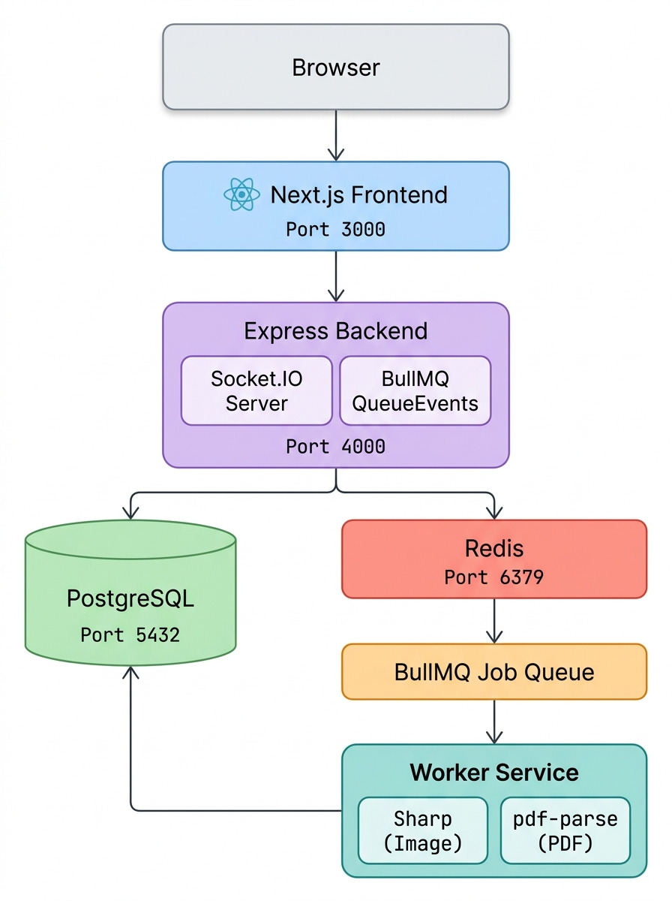
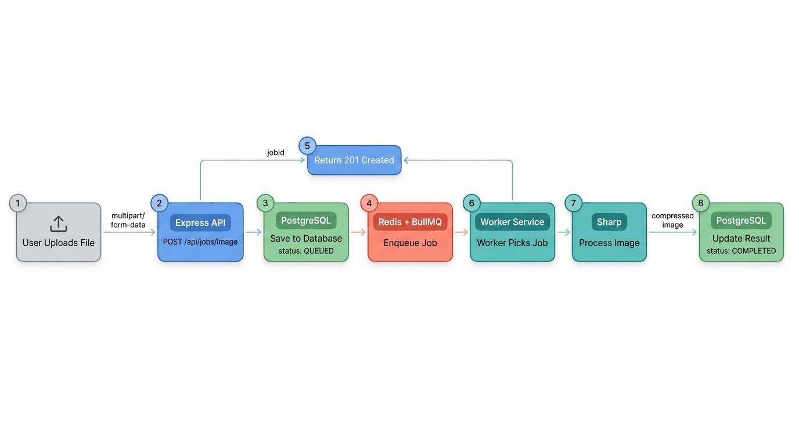
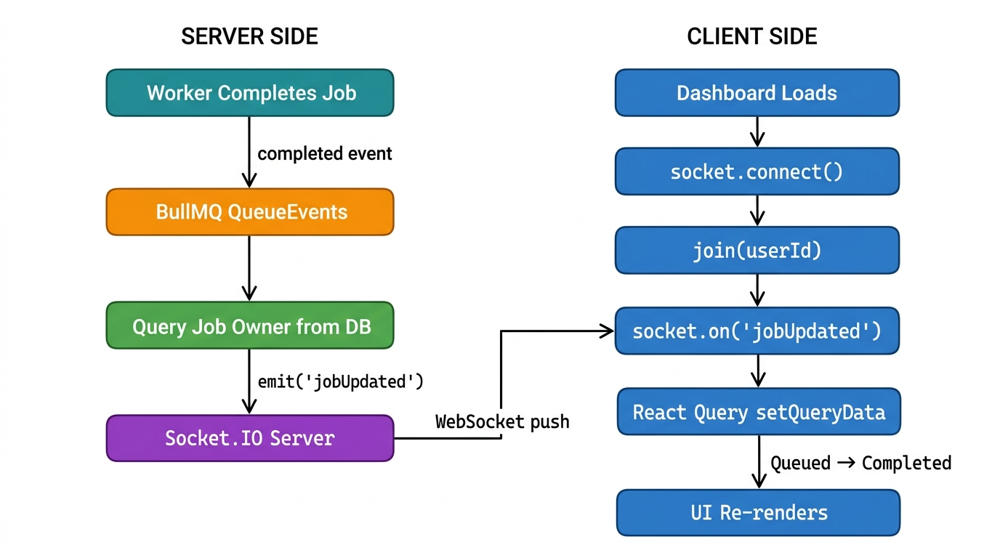
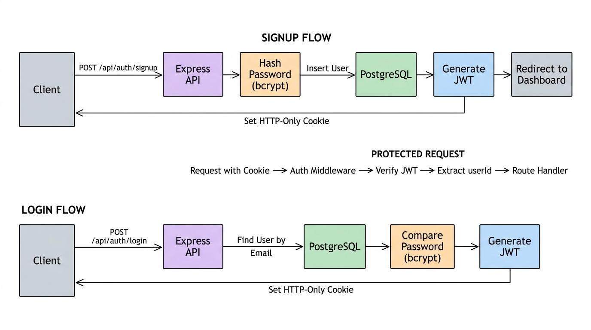
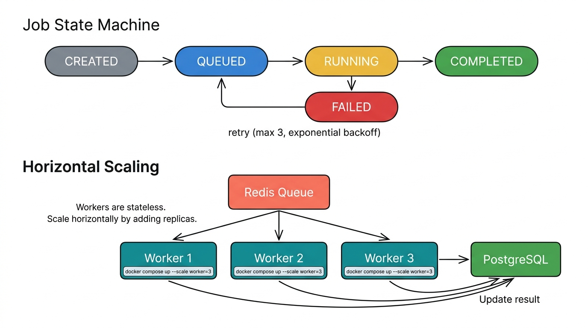
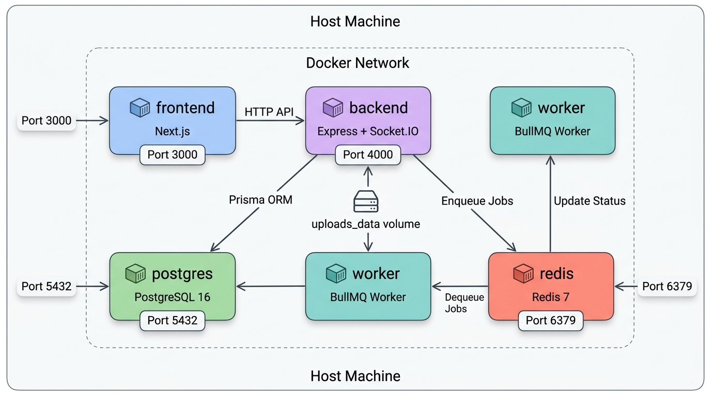
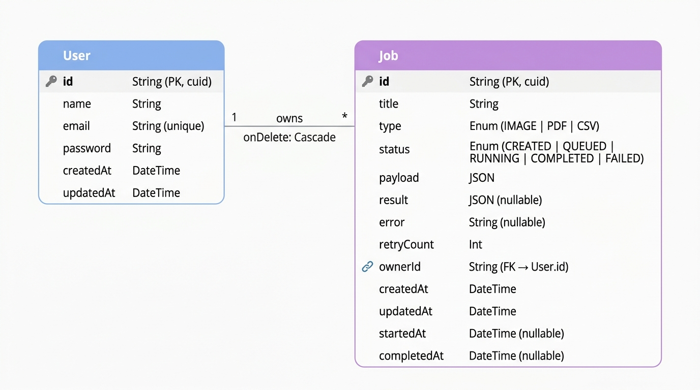

<div align="center">

# QueueForge

**A distributed job processing platform built with production-inspired architecture for asynchronous file processing at scale.**

[](https://www.typescriptlang.org/)
[](https://nodejs.org/)
[](https://nextjs.org/)
[](https://expressjs.com/)
[](https://www.postgresql.org/)
[](https://www.prisma.io/)
[](https://redis.io/)
[](https://docs.bullmq.io/)
[](https://socket.io/)
[](https://www.docker.com/)
[](LICENSE)

</div>

---

## Table of Contents

- [Why QueueForge Exists](#why-queueforge-exists)
- [Why Not Process Files Inside Express?](#why-not-process-files-inside-express)
- [Features](#features)
- [Tech Stack](#tech-stack)
- [Architecture](#architecture)
- [Upload Request Flow](#upload-request-flow)
- [How Realtime Updates Work](#how-realtime-updates-work)
- [Authentication Flow](#authentication-flow)
- [Queue Lifecycle & Scaling](#queue-lifecycle--scaling)
- [Docker Architecture](#docker-architecture)
- [Database Schema](#database-schema)
- [Project Structure](#project-structure)
- [Architecture Decisions](#architecture-decisions)
- [Environment Variables](#environment-variables)
- [Getting Started](#getting-started)
- [API Reference](#api-reference)
- [Screenshots](#screenshots)
- [Future Improvements](#future-improvements)
- [Lessons Learned](#lessons-learned)
- [Engineering Highlights](#engineering-highlights)
- [License](#license)

---

## Why QueueForge Exists

Web applications frequently need to perform heavy operations — image compression, PDF text extraction, report generation, video transcoding. The naive approach is to handle these inside the HTTP request handler:

```
User uploads 10MB image → Express compresses it → 5 seconds later → responds
```

This works for a demo. It breaks in production.

When you process files synchronously inside Express:

- **The event loop blocks.** Node.js is single-threaded. One slow image resize freezes every other incoming request.
- **Requests time out.** A 10MB image takes 2-5 seconds to compress. Meanwhile, the HTTP connection is held open, consuming memory and a connection slot.
- **The server doesn't scale.** 10 concurrent uploads = 10 blocked connections = an unresponsive API.
- **Failures cascade.** If image processing crashes, it takes down the API server with it.

QueueForge solves this by separating **job submission** from **job execution**:

1. The API server accepts the upload, saves metadata to PostgreSQL, pushes a job to a Redis-backed BullMQ queue, and responds immediately.
2. A dedicated Worker service pulls jobs off the queue, processes the files, and writes results back to the database.
3. QueueEvents listeners detect job state changes and push realtime updates to connected clients via Socket.IO.

The API stays fast. The worker handles the heavy lifting. Users see status updates without refreshing.

---

## Why Not Process Files Inside Express?

This deserves its own section because it's a core architectural decision.

Express is designed to handle the **request/response lifecycle** — validate input, query the database, return JSON. It should spend milliseconds per request, not seconds.

Heavy CPU tasks inside Express:

- Block the event loop
- Increase response latency for all users
- Reduce throughput
- Make the server vulnerable to cascading failures

**Therefore, processing is moved to a dedicated worker.**

The Express server's only job during a file upload is:

1. Save the file to disk
2. Create a database record
3. Push a lightweight message `{ jobId }` to the queue
4. Return `201 Created`

This takes ~50ms. The worker handles the rest asynchronously.

---

## Features

| Category | Details |
|---|---|
| **Authentication** | JWT signup/login with HTTP-only cookies, protected routes, session persistence |
| **Image Processing** | Automated compression and resizing via Sharp |
| **PDF Processing** | Text extraction and metadata parsing via pdf-parse |
| **Job Queue** | BullMQ with 3 retries, exponential backoff, dead-letter handling |
| **Realtime Updates** | Socket.IO pushes status changes to the dashboard instantly — no polling |
| **Worker Service** | Dedicated Node.js process consuming jobs independently from the API |
| **Compression Metrics** | Original size, compressed size, savings percentage, processing duration |
| **Docker** | Full multi-container setup with Docker Compose and shared volumes |
| **REST API** | Clean, authenticated endpoints with pagination and filtering |
| **Database** | PostgreSQL with Prisma ORM — type-safe queries, declarative schema |

---

## Tech Stack

### Frontend

| Technology | Purpose | Version |
|---|---|---|
| [Next.js](https://nextjs.org/) | React framework with App Router | `15.x` |
| [TypeScript](https://www.typescriptlang.org/) | Type safety | `5.x` |
| [TailwindCSS](https://tailwindcss.com/) | Utility-first CSS | `3.x` |
| [TanStack Query](https://tanstack.com/query) | Server state management + caching | `5.x` |
| [Axios](https://axios-http.com/) | HTTP client | `1.x` |
| [Socket.IO Client](https://socket.io/) | WebSocket client | `4.x` |

### Backend

| Technology | Purpose | Version |
|---|---|---|
| [Node.js](https://nodejs.org/) | Runtime | `20+` |
| [Express](https://expressjs.com/) | HTTP framework | `4.x` |
| [Prisma](https://www.prisma.io/) | ORM + database toolkit | `6.x` |
| [PostgreSQL](https://www.postgresql.org/) | Relational database | `16` |
| [BullMQ](https://docs.bullmq.io/) | Job queue | `5.x` |
| [Redis](https://redis.io/) | Queue backing store | `7` |
| [Socket.IO](https://socket.io/) | WebSocket server | `4.x` |
| [Multer](https://github.com/expressjs/multer) | File upload handling | `1.x` |
| [JSON Web Token](https://github.com/auth0/node-jsonwebtoken) | Authentication | `9.x` |
| [bcrypt](https://github.com/kelektiv/node.bcrypt.js) | Password hashing | `5.x` |

### Worker

| Technology | Purpose | Version |
|---|---|---|
| [BullMQ Worker](https://docs.bullmq.io/) | Job consumer | `5.x` |
| [Sharp](https://sharp.pixelplumbing.com/) | Image compression/resizing | `0.33.x` |
| [pdf-parse](https://www.npmjs.com/package/pdf-parse) | PDF text extraction | `1.x` |

### Infrastructure

| Technology | Purpose |
|---|---|
| [Docker](https://www.docker.com/) | Containerization |
| [Docker Compose](https://docs.docker.com/compose/) | Multi-container orchestration |

---

## Architecture



The system consists of five services:

- **Next.js Frontend** — Renders the UI, handles authentication flows, file uploads, and displays realtime job status
- **Express Backend** — REST API, Socket.IO server, and BullMQ QueueEvents listener. Accepts uploads, enqueues jobs, and broadcasts status changes
- **Worker Service** — Standalone Node.js process that consumes jobs from the Redis queue, processes files using Sharp/pdf-parse, and writes results to PostgreSQL
- **PostgreSQL** — Stores users, jobs, processing results, and metadata
- **Redis** — Backs the BullMQ queue. Stores job payloads, manages job state transitions, and publishes events via Redis streams

---

## Upload Request Flow



**Step-by-step:**

1. User selects a file and clicks upload
2. Frontend sends a `POST /api/jobs/image` request with `multipart/form-data`
3. Express saves the file to disk via Multer, creates a job record in PostgreSQL with status `QUEUED`
4. Express pushes `{ jobId }` to the BullMQ queue in Redis
5. Express returns `201 Created` to the frontend immediately (~50ms)
6. The Worker picks up the job from the queue
7. Worker updates the job status to `RUNNING`, processes the image with Sharp
8. Worker writes the compressed result and `COMPLETED` status to PostgreSQL
9. QueueEvents detects the state change, Socket.IO pushes the update to the user's dashboard
10. The status badge transitions from `Queued → Running → Completed` without any page refresh

---

## How Realtime Updates Work



QueueForge achieves zero-latency UI updates through a five-stage event pipeline:

```
Worker finishes job
       ↓
BullMQ fires "completed" event on Redis stream
       ↓
QueueEvents listener (backend) receives the event
       ↓
Backend queries DB for the job owner, emits via Socket.IO to user's room
       ↓
Frontend receives WebSocket event, updates React Query cache in-place
       ↓
Dashboard re-renders — no refresh, no polling
```

**How the frontend handles it:**

```typescript
// On dashboard load
socket.connect();
socket.on("connect", () => socket.emit("join", userId));

// On status update
socket.on("jobUpdated", ({ jobId, status }) => {
  queryClient.setQueryData(["jobs"], (old) => ({
    ...old,
    jobs: old.jobs.map(job =>
      job.id === jobId ? { ...job, status } : job
    )
  }));
});
```

React Query's cache is the single source of truth. Updating it via `setQueryData` triggers a React re-render — the status badge changes instantly without a network round-trip.

---

## Authentication Flow



**Signup:**
1. Client sends `POST /api/auth/signup` with `{ name, email, password }`
2. Express hashes the password with bcrypt (10 salt rounds)
3. Creates the user in PostgreSQL
4. Generates a JWT containing `{ userId, email }`
5. Sets the JWT in an HTTP-only cookie (`sameSite: lax`, `secure` in production)
6. Returns `201 Created`

**Login:**
1. Client sends `POST /api/auth/login` with `{ email, password }`
2. Express looks up the user by email
3. Compares the password hash with bcrypt
4. Generates a JWT and sets it as an HTTP-only cookie
5. Returns `200 OK`

**Protected Routes:**
Every authenticated request passes through the auth middleware:
```
Cookie → Extract JWT → Verify signature → Attach userId to req.user → Route handler
```

---

## Queue Lifecycle & Scaling



### Job State Machine

```
CREATED → QUEUED → RUNNING → COMPLETED
                      ↓
                   FAILED
                      ↓ (retry, max 3, exponential backoff)
                   QUEUED
```

### Retry Strategy

Jobs are configured with:
- **3 attempts** before moving to failed state
- **Exponential backoff** starting at 2 seconds (2s → 4s → 8s)
- Completed and failed jobs are retained (last 100) for debugging

### Horizontal Scaling

Workers are stateless. They pull jobs from a shared Redis queue and write results to a shared PostgreSQL database. To handle more load, add more workers:

```bash
docker compose up --scale worker=3
```

Redis distributes jobs across available workers automatically. No code changes required.

---

## Docker Architecture



| Container | Image | Port | Role |
|---|---|---|---|
| `my_postgres` | `postgres:16` | `5432` | Relational database |
| `my_redis` | `redis:7` | `6379` | Queue backing store |
| `jobflow-backend` | Custom | `4000` | Express API + Socket.IO + QueueEvents |
| `jobflow-worker` | Custom | — | BullMQ Worker (no exposed port) |
| `jobflow-frontend` | Custom | `3000` | Next.js application |

**Shared Volume:** Backend and Worker mount a shared Docker volume (`uploads_data`) at `/app/uploads`. The backend writes uploaded files, the worker reads and processes them.

**Internal DNS:** Containers communicate using Docker's internal DNS — `postgres:5432`, `my_redis:6379`. They never use `localhost` inside the network.

---

## Database Schema



### User

| Column | Type | Constraints |
|---|---|---|
| `id` | `String` | Primary key, cuid |
| `name` | `String` | — |
| `email` | `String` | Unique |
| `password` | `String` | Bcrypt hash |
| `createdAt` | `DateTime` | Auto-set |
| `updatedAt` | `DateTime` | Auto-updated |

### Job

| Column | Type | Constraints |
|---|---|---|
| `id` | `String` | Primary key, cuid |
| `title` | `String` | Original filename |
| `type` | `Enum` | `IMAGE` · `PDF` · `CSV` |
| `status` | `Enum` | `CREATED` · `QUEUED` · `RUNNING` · `COMPLETED` · `FAILED` |
| `payload` | `Json` | Input data (file path) |
| `result` | `Json?` | Processing output (compressed path, sizes) |
| `error` | `String?` | Error message on failure |
| `retryCount` | `Int` | Default: 0 |
| `ownerId` | `String` | FK → User.id (CASCADE delete) |
| `createdAt` | `DateTime` | Auto-set |
| `startedAt` | `DateTime?` | Set when worker picks up job |
| `completedAt` | `DateTime?` | Set when processing finishes |

**Relationship:** `User 1 ——— * Job` (one user owns many jobs, cascade delete)

---

## Project Structure

```
queueforge/
├── backend/                        # Express API Server
│   ├── src/
│   │   ├── controllers/            # Route handlers (auth, jobs)
│   │   ├── services/               # Business logic layer
│   │   ├── routes/                 # Route definitions
│   │   ├── middlewares/            # Auth middleware, file upload (Multer)
│   │   ├── lib/                    # Prisma client, Redis, BullMQ queue, QueueEvents
│   │   ├── socket/                 # Socket.IO initialization + room management
│   │   ├── config/                 # App configuration
│   │   ├── types/                  # TypeScript declarations
│   │   ├── utils/                  # Helpers
│   │   ├── app.ts                  # Express app (CORS, routes, middleware)
│   │   └── index.ts                # Entry point (HTTP server + Socket.IO + QueueEvents)
│   ├── prisma/
│   │   └── schema.prisma           # Database schema
│   └── Dockerfile
│
├── worker/                         # Background Job Processor
│   ├── src/
│   │   ├── processors/             # Job processor + factory pattern
│   │   ├── services/               # Sharp image + PDF processing logic
│   │   ├── lib/                    # Redis + Prisma instances
│   │   └── index.ts                # Entry point (BullMQ Worker)
│   ├── prisma/
│   │   └── schema.prisma           # Shared schema
│   └── Dockerfile
│
├── frontend/                       # Next.js Client
│   ├── app/
│   │   ├── dashboard/              # Dashboard (upload + job list)
│   │   ├── jobs/[id]/              # Job detail (metrics, timeline, download)
│   │   ├── login/                  # Login page
│   │   ├── signup/                 # Signup page
│   │   └── page.tsx                # Landing page
│   ├── components/                 # UI components (UploadImage, UploadPdf)
│   ├── hooks/                      # React Query hooks (useJobs, useMe, useSignup)
│   ├── lib/                        # Axios instance, Socket.IO client
│   └── Dockerfile
│
├── docker-compose.yml              # Multi-container orchestration
└── README.md
```

---

## Architecture Decisions

| Decision | Why |
|---|---|
| **Redis** | In-memory store with sub-millisecond latency. BullMQ uses Redis streams for reliable job event delivery. |
| **BullMQ over raw Redis** | BullMQ provides retries, exponential backoff, job prioritization, rate limiting, and concurrency control out of the box. Building this from scratch on raw Redis is error-prone. |
| **Socket.IO over SSE** | Socket.IO handles reconnection, room-based routing, and fallback transports automatically. Server-Sent Events would require custom reconnection logic and don't support rooms. |
| **QueueEvents over polling** | BullMQ's QueueEvents listens to Redis streams for job state transitions. This is event-driven — no polling interval, no wasted cycles. |
| **Prisma over raw SQL** | Type-safe queries generated from the schema. Eliminates SQL injection, provides IDE auto-complete, and handles migrations declaratively. |
| **Dedicated Worker** | Isolates CPU-bound file processing from the API server. If the worker crashes, the API stays healthy. Workers can be scaled independently. |
| **TanStack Query** | Manages server state with built-in caching, deduplication, and background refetching. Socket events update the cache via `setQueryData` — instant UI updates without a network round-trip. |
| **Docker Compose** | Reproducible multi-service setup. One command starts the full stack. Eliminates environment inconsistencies. |

---

## Environment Variables

### Backend (`backend/.env`)

| Variable | Required | Description |
|---|---|---|
| `DATABASE_URL` | Yes | PostgreSQL connection string |
| `REDIS_URL` | Yes | Redis connection string |
| `JWT_SECRET` | Yes | Secret for signing JWT tokens |
| `PORT` | No | HTTP server port (default: `4000`) |

### Worker (`worker/.env`)

| Variable | Required | Description |
|---|---|---|
| `DATABASE_URL` | Yes | PostgreSQL connection string |
| `REDIS_URL` | Yes | Redis connection string |
| `UPLOADS_BASE_PATH` | No | Base path for file I/O (default: `../backend`) |

### Frontend (`frontend/.env.local`)

| Variable | Required | Description |
|---|---|---|
| `NEXT_PUBLIC_API_URL` | Yes | Backend API URL including `/api` prefix |

---

## Getting Started

### Prerequisites

- Node.js ≥ 20
- Docker & Docker Compose

### Docker Setup (Recommended)

```bash
git clone https://github.com/Harshgg1/Distributed-Job-Processing-Platform.git
cd Distributed-Job-Processing-Platform

docker compose up --build
```

The backend automatically runs `prisma db push` on startup to sync the database schema.

| Service | URL |
|---|---|
| Frontend | http://localhost:3000 |
| Backend API | http://localhost:4000 |
| PostgreSQL | localhost:5432 |
| Redis | localhost:6379 |

### Local Development

```bash
# 1. Start infrastructure
docker compose up postgres redis -d

# 2. Backend
cd backend
npm install
cp .env.example .env        # Set DATABASE_URL, REDIS_URL, JWT_SECRET
npx prisma db push
npm run dev                  # → localhost:4000

# 3. Worker (new terminal)
cd worker
npm install
npx prisma generate
npm run dev

# 4. Frontend (new terminal)
cd frontend
npm install
cp .env.example .env.local   # Set NEXT_PUBLIC_API_URL=http://localhost:4000/api
npm run dev                   # → localhost:3000
```

---

## API Reference

### Authentication

| Method | Endpoint | Body | Response | Auth |
|---|---|---|---|---|
| `POST` | `/api/auth/signup` | `{ name, email, password }` | `201` — User + JWT cookie | No |
| `POST` | `/api/auth/login` | `{ email, password }` | `200` — User + JWT cookie | No |
| `POST` | `/api/auth/logout` | — | `200` — Clears cookie | No |
| `GET` | `/api/auth/me` | — | `200` — Current user | Yes |

### Jobs

| Method | Endpoint | Body | Response | Auth |
|---|---|---|---|---|
| `POST` | `/api/jobs/image` | `multipart/form-data` (field: `image`) | `201` — Job record | Yes |
| `POST` | `/api/jobs/pdf` | `multipart/form-data` (field: `pdf`) | `201` — Job record | Yes |
| `GET` | `/api/jobs` | Query: `?status=COMPLETED&type=IMAGE&page=1&limit=10` | `200` — Paginated jobs | Yes |
| `GET` | `/api/jobs/:id` | — | `200` — Job with result | Yes |

### Health

| Method | Endpoint | Response |
|---|---|---|
| `GET` | `/health` | `200` — `{ status: "ok" }` |

### WebSocket Events

| Event | Direction | Payload | Description |
|---|---|---|---|
| `join` | Client → Server | `userId` | Subscribe to job updates |
| `jobUpdated` | Server → Client | `{ jobId, status }` | Realtime status change |

---

## Screenshots

> Replace these with actual screenshots of your running application.

| Page | Description |
|---|---|
| Landing | Product page with feature highlights |
| Signup / Login | Authentication forms with error handling |
| Dashboard | File upload cards + realtime job list with status badges |
| Job Detail | Processing timeline, compression metrics, download link |
| Realtime Status | Status badges transitioning: Queued → Running → Completed |

---

## Future Improvements

| Area | Improvement |
|---|---|
| Storage | AWS S3 for file storage + CloudFront CDN |
| Messaging | RabbitMQ for cross-service pub/sub communication |
| Orchestration | Kubernetes deployment with Helm charts |
| Scaling | Horizontal worker auto-scaling based on queue depth |
| Notifications | Email notifications via SendGrid on job completion |
| Security | Rate limiting per user on API endpoints |
| Monitoring | Prometheus metrics + Grafana dashboards for queue depth, processing latency, error rates |
| CI/CD | GitHub Actions pipeline — lint, test, build, deploy |
| Logging | Structured logging with Pino + centralized log aggregation |
| Testing | Integration tests for the full job lifecycle using Testcontainers |

---

## Lessons Learned

**Distributed systems are about failure handling, not happy paths.**
The hard part isn't processing jobs — it's handling failures gracefully. BullMQ's retry mechanism with exponential backoff and dead-letter handling provided a framework for thinking about failure modes systematically.

**Queues decouple throughput from latency.**
Before implementing the queue, every file upload was a blocking operation. Moving to an async queue meant the API could respond in milliseconds regardless of file size. This separation is the foundation of scalable backend design.

**Realtime communication requires careful state synchronization.**
Socket.IO makes it easy to push events. The challenge is keeping the frontend's state consistent. Using React Query's `setQueryData` to surgically update the cache eliminated race conditions and avoided unnecessary refetches.

**Docker changes how you think about infrastructure.**
Containerizing the application forced me to think about service boundaries, network isolation, shared volumes, and environment configuration as first-class concerns — not afterthoughts. Problems like "the worker can't access the uploaded file" become immediately obvious when services run in isolated containers.

**Background processing is a core backend skill.**
Most production systems rely on job queues for emails, image processing, data pipelines, and report generation. Understanding the worker pattern, job lifecycle, and queue semantics is fundamental to building systems that handle load reliably.

---

## Engineering Highlights

This project demonstrates the following concepts:

| Concept | Implementation |
|---|---|
| **Distributed Architecture** | Three independent services (API, Worker, Frontend) communicating via Redis and PostgreSQL |
| **Asynchronous Processing** | BullMQ queue decoupling request handling from CPU-bound file processing |
| **Event-Driven Systems** | QueueEvents listening to Redis streams, triggering Socket.IO emissions on state changes |
| **Realtime Communication** | Socket.IO with room-based routing + React Query cache synchronization |
| **Containerization** | Multi-container Docker Compose with shared volumes, internal networking, and environment isolation |
| **Scalable Backend** | Stateless API + horizontally scalable workers — scale by adding replicas |
| **REST API Design** | Resource-oriented endpoints with JWT auth, pagination, and filtering |
| **Database Modeling** | PostgreSQL with Prisma — type-safe queries, relational schema, cascade deletes |
| **Queue Processing** | BullMQ with retries, exponential backoff, and job state tracking |
| **Worker Pattern** | Factory pattern for extensible job type handling (IMAGE, PDF, CSV) |

---

## License

This project is licensed under the [MIT License](LICENSE).

---

<div align="center">

Built by [Harshgg1](https://github.com/Harshgg1)

</div>
